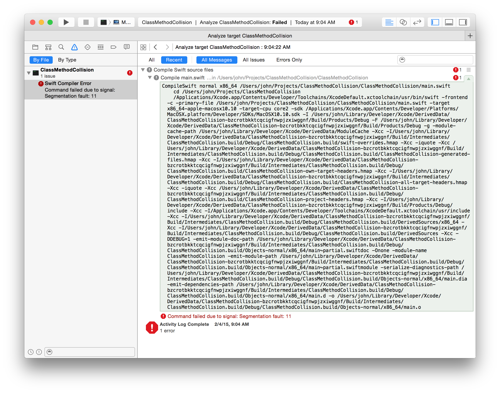

SwiftClassMethodCollision
=========================

**Update:** As of Swift 1.2, this code produces a compilation error instead of a segfault.

This project illustrates a bug in swift 1.1 that causes a segmentation fault.

Creating a class with a method of the same name of the class, that returns an instance of the class, causes a segmentation fault when compiling.

```swift
class MyClass {
  func MyClass() -> MyClass {
    return MyClass()
  }
}

```

This can be seen by opening the project in XCode.



Or compiling from the command line.

```bash
$ swift SwiftClassMethodCollision/main.swift
Segmentation fault: 11
```

Radar
-----
This was submitted to Apple as [rdar://19715729](rdar://19715729)
